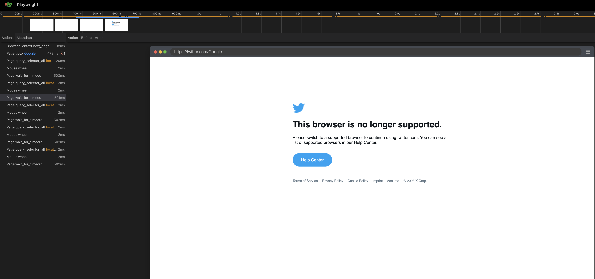

# Initial requirements:
- python 3.11;
- pip
- venv

# Steps to run:
1. Install dependencies by using the following command:
```shell
pip install -r requirements.txt
```
2. Install Playwright browsers:
```shell
playwright install
```
3. Run tests:
```shell
python -m pytest -s
```
- `-s` flag is to see the output result

# Issues found:
Twitter blocks headless Chrome, so it's impossible to scrape through this mode.



The only possible option for Chrome is headed.